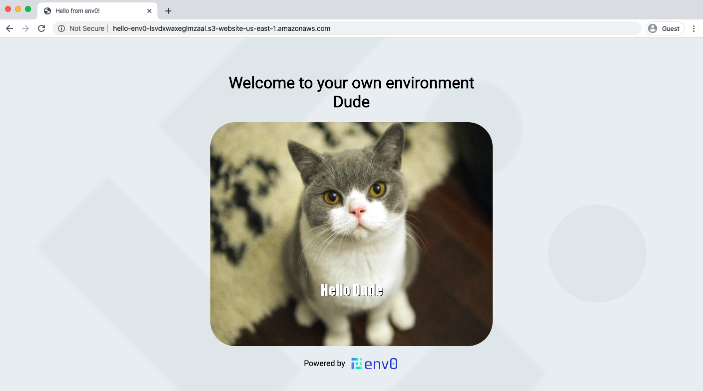

# Hello World on IBM
A static website IBM Cloud Object Storage bucket serving an HTML greeting the user with his own custom cat image

## Configuration

### Environment Variables
- `USER` - sets the user name to greet on the html generated from `index.template.html`

### Terraform Variables
None
